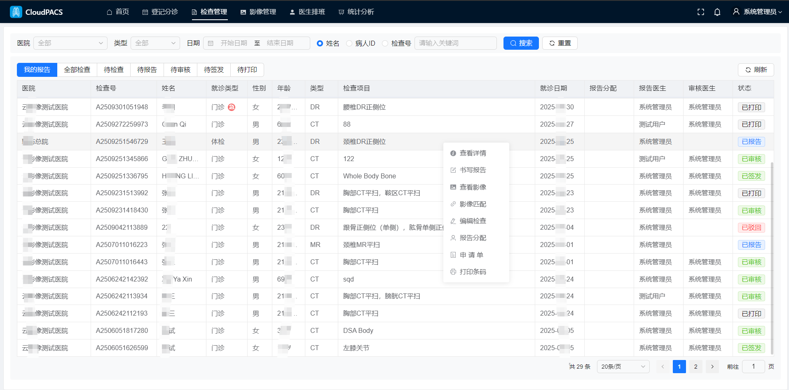
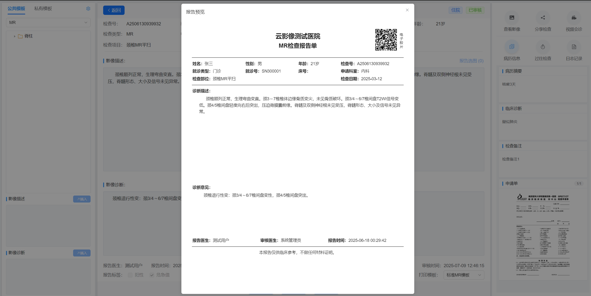
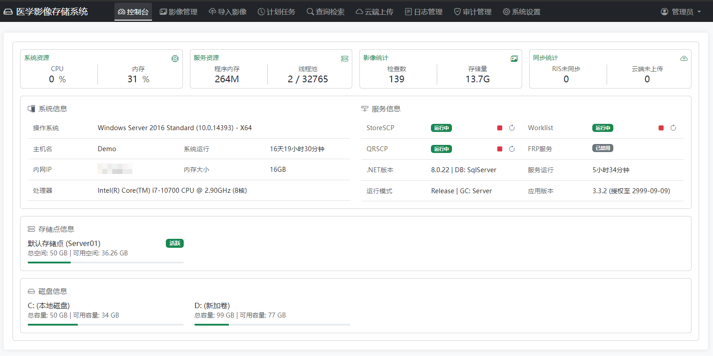
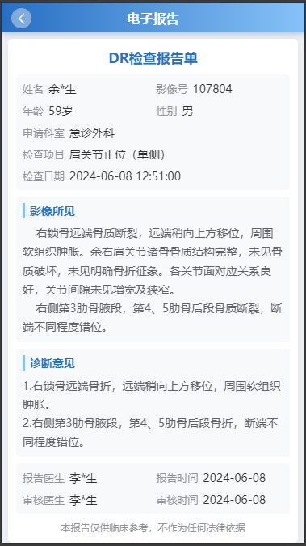
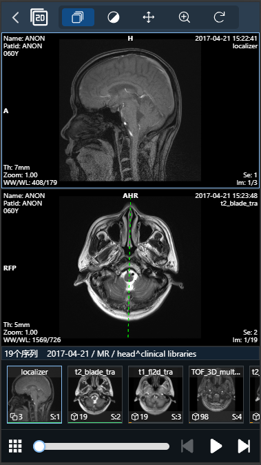
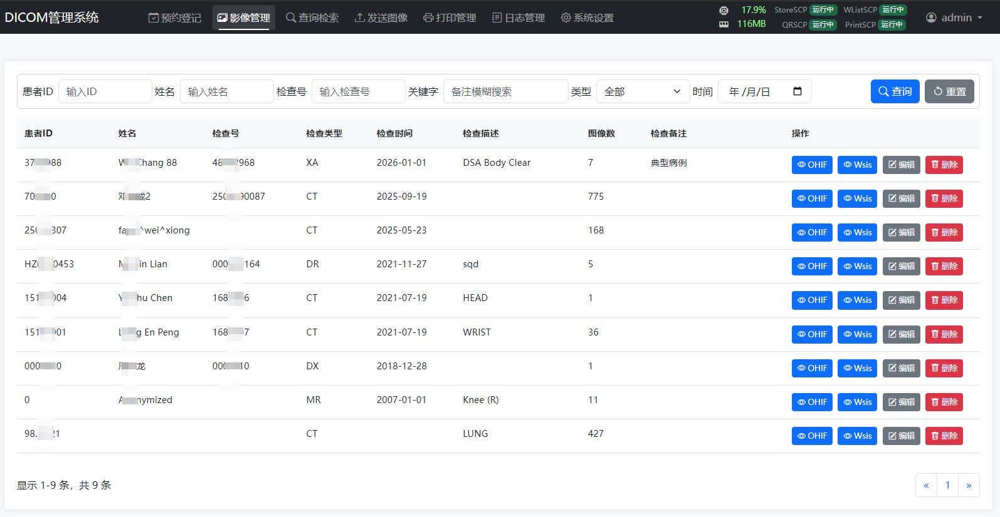

## 🏆 中文开源社区高完成度的 DICOM / PACS 基础服务组件

<p>
  <a href="LICENSE"></a>
  <a href="https://dotnet.microsoft.com/"></a>
  <a href="https://github.com/fightroad/DicomSCP/releases/latest"></a>
  <a href="https://gitee.com/fightroad/DicomSCP"></a>
  <a href="https://gitee.com/fightroad/DicomSCP"></a>
  <a href="https://github.com/fightroad/DicomSCP"></a>
  <a href="https://github.com/fightroad/DicomSCP"></a>
  <a href="https://gitee.com/fightroad/DicomSCP"></a>
</p>

**快速入口**：[`快速开始`](#快速开始) | [`Docker部署`](#docker部署) | [`配置说明`](#配置说明) | [`商业咨询（微信/QQ：30760655）`](#commercial-consult)

> 关键词：开源 DICOM SCP、轻量级 PACS、DICOMWeb（WADO-RS / QIDO-RS）、Worklist、Query/Retrieve、医学影像系统集成。

- DicomSCP 是一个基于 .NET Core 的 DICOM 医学影像基础服务组件，提供轻量级 PACS 核心能力，可用于 DICOM 接入、影像存储、查询检索与系统集成。
- 本项目由多年医学影像从业经验积累而来，旨在为中文医学影像生态提供一个轻量、开放、可扩展的 DICOM/PACS 基础设施实现。不限制使用，请遵守[MIT许可协议](LICENSE)。如果项目对您有帮助，欢迎[赞助](#赞助项目)支持我们继续改进！
- 提供完整商业版云RIS/PACS（区域云影像）和云胶片（数字胶片）解决方案助力紧密型医共体和医保影像云，亦可提供医疗信息化相关的定制开发和接口改造服务，有相关需求可以联系咨询！ 微信/QQ：30760655
- 相关配套子系统介绍：[dicom-acquisition](https://gitee.com/fightroad/dicom-acquisition) | [dicom-server](https://gitee.com/fightroad/dicom-server) | [data-integration-engine](https://gitee.com/fightroad/data-integration-engine)
- 测试工具（用于联调与传输测试）：[pacs-explorer](https://gitee.com/fightroad/pacs-explorer) | [mini-scu](https://gitee.com/fightroad/mini-scu) | [DicomTransfer](https://gitee.com/fightroad/DicomTransfer) | [DicomStoreScp](https://gitee.com/fightroad/DicomStoreScp) | [DicomProxy_Viewer](https://gitee.com/fightroad/DicomProxy_Viewer)
- [项目Gitee仓库](https://gitee.com/fightroad/DicomSCP)  |  [项目GitHub仓库](https://github.com/fightroad/DicomSCP) 

<a id="commercial-consult"></a>
## 🔗 开源 vs 商业版本

| 维度 | DicomSCP（开源） | 商业解决方案 |
|------|------------------|--------------|
| 定位 | DICOM/PACS 基础服务组件 | 医疗影像完整业务系统 |
| 面向对象 | 开发者 / 研究人员 / AI团队 | 医院 / 医疗企业 / 集成商 |
| 目标用途 | 技术学习 / PoC验证 / 系统联调 | 生产环境部署 / 业务系统建设 |
| 覆盖范围 | DICOM核心服务能力（SCP / Worklist / Query / WADO等） | RIS + PACS + 云影像 + 云胶片 + 系统集成 |
| 系统形态 | 独立基础服务组件 | 完整医疗影像业务平台 |
| 部署方式 | Docker / 本地快速运行 | 私有化部署 / 多院区架构 / 云平台部署 |
| 维护模式 | 社区维护（开源） | 项目制交付 + 定制支持 |
| 扩展能力 | 提供基础接口与协议实现 | 支持医院系统对接（HIS / EMR / AI影像平台） |


## 商业解决方案部分预览



 


## 赞助项目

如果这个项目对您有帮助，欢迎赞助支持我们继续改进！

<table>
  <tr>
    <td align="center">
      
      <br/>
      微信赞助
    </td>
    <td align="center">
      
      <br/>
      支付宝赞助
    </td>
  </tr>
</table>

您的每一份支持都将帮助我们:
- 🚀 开发新功能
- 🐛 修复已知问题
- 📚 完善项目文档
- 🎨 优化用户体验

赞助时请备注您的信息，我们会将您添加到[赞助者名单](#赞助者)中。

## 开源版功能预览





  

## 功能特性

- **存储服务 (C-STORE SCP)**
  - 按照4个级别的标签入库和归档
  - 按照级别标签自动组织存储目录结构
  - 支持 JPEG、JPEG2000、JPEG-LS、RLE 等压缩

- **工作列表服务 (Worklist SCP)**
  - 提供标准 DICOM Modality Worklist 服务
  - 支持多种查询条件（患者ID、检查号、日期等）
  - 支持请求字符集协商自动中英文转换

- **查询检索服务 (QR SCP)**
  - 提供 C-FIND、C-MOVE、C-GET 服务
  - 可配置多个目标节点
  - 支持多种查询级别（Study/Series/Image）
  - 支持JPEG、JPEG2000、JPEG-LS、RLE 传输语法实时转码

- **打印服务 (Print SCP)**
  - 打印任务队列管理
  - 打印任务状态跟踪
  - 归档打印的原始文件和标签

- **WADOURI 服务 (Web Access to DICOM Objects)**
  - 必需参数
    - `requestType`: 必须为 "WADO"
    - `studyUID`: 研究实例 UID
    - `seriesUID`: 序列实例 UID
    - `objectUID`: 实例 UID

  - 可选参数
    - `contentType`: 返回内容类型 不传默认 image/jpeg
      - `application/dicom`: 返回 DICOM 格式
      - `image/jpeg`: 返回 JPEG 格式
    
    - `transferSyntax`: DICOM 传输语法 UID 不传默认不转码
      - `1.2.840.10008.1.2`: Implicit VR Little Endian
      - `1.2.840.10008.1.2.1`: Explicit VR Little Endian
      - `1.2.840.10008.1.2.4.50`: JPEG Baseline
      - `1.2.840.10008.1.2.4.57`: JPEG Lossless
      - `1.2.840.10008.1.2.4.70`: JPEG Lossless SV1
      - `1.2.840.10008.1.2.4.90`: JPEG 2000 Lossless
      - `1.2.840.10008.1.2.4.91`: JPEG 2000 Lossy
      - `1.2.840.10008.1.2.4.80`: JPEG-LS Lossless
      - `1.2.840.10008.1.2.5`: RLE Lossless

    - `anonymize`: 是否匿名化
      - `yes`: 执行匿名化处理
      - 其他值或不传: 不进行匿名化

  - 完整请求参数例子
    ```
    http://localhost:5000/wado?requestType=WADO&studyUID=1.2.840.113704.1.111.5096.1719875982.1&seriesUID=1.3.46.670589.33.1.13252761201319485513.2557156297609063016&objectUID=1.3.46.670589.33.1.39304787935332940.2231985654917411587&contentType=application/dicom&transferSyntax=1.2.840.10008.1.2.4.70&anonymize=yes
    ```

- **CSTORE-SCU (CSTORE-SCU)**
  - 支持发送DICOM图像到DICOM SCP
  - 可配置多个目标节点

- **Print-SCU (Print-SCU)**
  - 支持将PRINTSCP接收到的图像打印到其他打印机或PRINTSCP服务
  - 构建打印图像会保留原始图像的标签信息

- **Log Service (日志服务)**
  - 支持查看、删除日志
  - 个服务日志独立配置
  - 多日志级别配置
  - 服务预置详细日志 方便对接查找问题

- **WADO-RS 服务 (Web Access to DICOM Objects - RESTful Services)**
  - 实例检索 (Instance Retrieval)
    ```
    GET /dicomweb/studies/{studyUID}/series/{seriesUID}/instances/{instanceUID}
    ```
    - 支持原始 DICOM 格式检索
    - 支持传输语法转换
    - 支持 multipart/related 响应
    - 支持 Accept 头指定返回格式
    - 支持检查/序列/实例三个级别的检索
    - 支持 transfer-syntax 参数指定传输语法

  - 元数据检索 (Metadata Retrieval)
    ```
    GET /dicomweb/studies/{studyUID}/series/{seriesUID}/metadata
    ```
    - 返回 DICOM JSON 格式
    - 包含完整的 DICOM 标签信息
    - 支持 VR 和 Value 的标准格式
    - 符合 DICOMweb 规范的空值处理

  - 帧检索 (Frame Retrieval)
    ```
    GET /dicomweb/studies/{studyUID}/series/{seriesUID}/instances/{instanceUID}/frames/{frames}
    ```
    - 支持单帧/多帧提取
    - 保持原始像素数据
    - 支持传输语法转换

  - 缩略图服务 (Thumbnail)
    ```
    GET /dicomweb/studies/{studyUID}/series/{seriesUID}/thumbnail?size={size}
    GET /dicomweb/studies/{studyUID}/series/{seriesUID}/thumbnail?viewport={viewport}
    ```
    - 支持自定义尺寸
      - size: 指定输出图像大小（可选，默认 128）
      - viewport: 指定视口大小（可选，与 size 参数互斥）
    - 保持图像宽高比
    - JPEG 格式输出
    - 示例：
      ```
      /dicomweb/studies/1.2.3/series/4.5.6/thumbnail?size=256
      /dicomweb/studies/1.2.3/series/4.5.6/thumbnail?viewport=512
      ```

- **QIDO-RS 服务 (Query based on ID for DICOM Objects - RESTful Services)**
  - 研究级查询 (Study Level Query)
    ```
    # DICOMweb 标准格式
    GET /dicomweb/studies?00100020={patientID}&00100010={patientName}&00080020={date}&00200010={accessionNumber}&0020000D={studyUID}&00080060={modality}&offset={offset}&limit={limit}&fuzzy=true
    
    # 友好格式（兼容）
    GET /dicomweb/studies?PatientID={patientID}&PatientName={patientName}&StudyDate={date}&AccessionNumber={accessionNumber}&StudyInstanceUID={studyUID}&Modality={modality}&offset={offset}&limit={limit}&fuzzy=true
    ```
    - 支持多种查询参数：
      - 标准 DICOM 标签格式：
        - 00100020: 患者 ID
        - 00100010: 患者姓名
        - 00080020: 检查日期
        - 00200010: 检查号
        - 0020000D: 检查实例 UID
        - 00080060: 检查类型/模态
      - 友好格式（等效）：
        - PatientID: 精确匹配或模糊匹配 (例如: "P123*" 匹配所有以 P123 开头的ID)
        - PatientName: 支持通配符 (例如: "*张*" 匹配包含"张"的姓名)
        - StudyDate: 支持日期范围 (例如: "20240101-20240131" 表示1月份的数据)
        - AccessionNumber: 检查号匹配
        - StudyInstanceUID: 检查实例 UID 精确匹配
        - Modality: 检查类型/模态 (例如: "CT" 或 "CT\MR" 支持多值)
        - fuzzy: 设置为 true 时启用模糊匹配
    - 支持分页功能（offset/limit）
    - 支持模糊匹配
    - 返回符合 DICOMweb 标准的 JSON 格式

  - 序列级查询 (Series Level Query)
    ```
    GET /dicomweb/studies/{studyUID}/series?SeriesInstanceUID={seriesUID}&Modality={modality}
    ```
    - 支持序列 UID 过滤
    - 支持模态过滤 (例如: "CT*" 匹配所有 CT 相关模态)
    - 返回序列详细信息
    - 符合 DICOMweb JSON 格式规范

  - 实例级查询 (Instance Level Query)
    ```
    GET /dicomweb/studies/{studyUID}/series/{seriesUID}/instances?SOPInstanceUID={instanceUID}
    ```
    - 支持 SOP 实例 UID 过滤
    - 返回实例详细信息
    - 包含图像参数信息

## 系统要求

- Windows 10/11 或 Windows Server 2012+
- .NET 8.0 或更高版本
- SQLite 3.x
- 8GB+ RAM
- 100GB+ 可用磁盘空间
- 现代浏览器（Chrome/Firefox/Edge）

## 构建和发布

Windows 单文件发布

发布为自包含的单文件可执行程序：

```bash
dotnet publish -c Release -r win-x64 /p:SelfContained=true /p:PublishSingleFile=true /p:IncludeNativeLibrariesForSelfExtract=true /p:DebugType=None /p:DebugSymbols=false
```

发布后的文件位于：`bin/Release/net8.0/win-x64/publish/DicomSCP.exe`

## 快速开始

1. 下载最新发布版本 [releases](https://gitee.com/fightroad/DicomSCP/releases)
2. 修改 appsettings.json 配置文件 [appsettings.json](#配置说明)
3. 运行 DicomSCP.exe
4. 访问 http://localhost:5000  
5. 默认账号 admin / admin

## 配置说明

主配置文件为运行目录下的 `appsettings.json`（Docker 见上文挂载路径）。完整字段以仓库内文件为准：

- [appsettings.json（Gitee）](https://gitee.com/fightroad/DicomSCP/blob/master/appsettings.json)

### DicomSettings（DICOM 服务）

| 配置项 | 说明 |
|--------|------|
| `AeTitle` | C-STORE SCP 的应用实体标题（AE Title） |
| `StoreSCPPort` | 存储服务监听端口（默认 11112） |
| `StoragePath` | 接收影像的归档目录，相对路径相对程序工作目录 |
| `TempPath` | 临时文件目录 |
| `Advanced` | 存储高级选项：`ValidateCallingAE` / `AllowedCallingAEs` 控制呼叫方 AE 校验；`EnableCompression`、`PreferredTransferSyntax` 等与压缩/传输语法相关 |
| `WorklistSCP` | 工作列表服务：`AeTitle`、`Port`（默认 11113）、呼叫方 AE 白名单等 |
| `QRSCP` | 查询检索 SCP：`Port`（默认 11114）、`MoveDestinations` 为 C-MOVE 目标节点列表（Name / AeTitle / HostName / Port） |
| `PrintSCP` | 打印 SCP：`Port`（默认 11115）、`AllowedCallingAEs` 等 |
| `PrintSCU` | 打印 SCU：`Printers` 为远端打印节点；`IsDefault` 指定默认打印机 |

### QueryRetrieveConfig（查询检索 SCU）

| 配置项 | 说明 |
|--------|------|
| `LocalAeTitle` | 本机作为 SCU 对外使用的 AE Title |
| `RemoteNodes` | 远端节点列表：`AeTitle`、`HostName`、`Port`、`Type`（如 `store` / `qr`）供界面或转发使用 |

### Kestrel（Web 与端口）

| 配置项 | 说明 |
|--------|------|
| `Kestrel:Endpoints:Http:Url` | HTTP 监听地址，默认 `http://0.0.0.0:5000`；改端口后 Docker 需同步 `-p` |
| `Kestrel:Limits:MaxRequestBodySize` | 请求体大小上限（字节），大文件上传时可按需调大 |

### ConnectionStrings（数据库）

| 配置项 | 说明 |
|--------|------|
| `DicomDb` | SQLite 连接串，`Data Source` 指向库文件路径（默认 `./db/dicom.db`）；Docker 下建议与挂载的 `db` 目录一致 |

### Logging / Swagger

- **Logging**：全局 `LogPath`、`RetainedDays`；`Services` 下可按服务（StoreSCP、QRSCP、WADO 等）单独开关文件/控制台日志、级别与目录。
- **Swagger**：`Enabled` 控制是否暴露 API 文档；生产环境可关闭。

修改 DICOM 端口或防火墙策略时，需与设备端 AE、IP、端口配置一致；修改路径后请确保进程对目录有读写权限。

## Docker部署
appsettings.json需要先在宿主机目录下创建好！

```
docker run -d --name DicomSCP --restart unless-stopped \
  -p 5000:5000 \
  -p 11112-11115:11112-11115 \
  -v /opt/docker/dicomscp/keys:/root/.aspnet/DataProtection-Keys \
  -v /opt/docker/dicomscp/logs:/app/logs \
  -v /opt/docker/dicomscp/received_files:/app/received_files \
  -v /opt/docker/dicomscp/temp_files:/app/temp_files \
  -v /opt/docker/dicomscp/appsettings.json:/app/appsettings.json \
  -v /opt/docker/dicomscp/db:/app/db \
  fightroad/dicomscp:latest

```

## 常见问题（FAQ）

### 点击 Weasis 没反应？

界面中的 Weasis 入口会尝试调用本机已安装的 **Weasis** 客户端打开影像。若未安装或安装路径未注册协议，点击可能无反应。请先安装 Weasis，再重试。

- **下载与发行版**：[Weasis GitHub Releases](https://github.com/nroduit/Weasis/releases)（Windows 可选 `.msi` 安装包）
- **官方文档**：[Weasis 安装说明](https://nroduit.github.io/en/getting-started/)

### Docker 启动失败？

容器依赖将宿主机的 `appsettings.json` 挂载进 `/app/appsettings.json`。请**先在宿主机**创建好 Docker 命令里各 `-v` 对应的目录与文件（尤其是 `appsettings.json`），内容可参考仓库中的示例后再启动容器，避免因缺少文件或目录导致启动失败。

- **示例配置**：[appsettings.json（Gitee）](https://gitee.com/fightroad/DicomSCP/blob/master/appsettings.json)

### C-MOVE 之后接收不到影像？

C-MOVE 会把影像推到**目标存储节点**（接收端）。若配置或类型不对，会出现“MOVE 成功但本机收不到”的情况。请检查 `appsettings.json` 中 **`QueryRetrieveConfig:RemoteNodes`** 是否已正确添加该目标节点，且 **`Type` 必须为 `store`**（表示 C-STORE 接收端）；`AeTitle`、`HostName`、`Port` 需与对端实际监听一致。

## Nginx反向代理

```
proxy_pass http://127.0.0.1:5000;
proxy_set_header Host $host:$server_port;
proxy_set_header X-Forwarded-Proto $scheme;
proxy_set_header X-Real-IP $remote_addr;
proxy_set_header X-Forwarded-For $proxy_add_x_forwarded_for;
proxy_set_header REMOTE-HOST $remote_addr;
proxy_set_header Upgrade $http_upgrade;
proxy_set_header Connection "Upgrade";
proxy_http_version 1.1;
```


## 使用的开源项目

本项目使用了以下优秀的开源项目：

- [fo-dicom](https://github.com/fo-dicom/fo-dicom) 
- [weasis](https://github.com/nroduit/Weasis)
- [OHIF](https://github.com/OHIF/Viewers)
- [Bootstrap](https://github.com/twbs/bootstrap)

感谢这些优秀的开源项目，让本项目得以实现！

## 赞助者

感谢以下赞助者的支持（排名不分先后）：

- **QQ：生活**
- **GITEE：mmkangaroo**
- **GITEE：wisgtalt**
- **GITEE：longlong159357**
- **GITEE：Dentalman**
- **alipay：恒**
- **wechat：syg**
- **GITEE：qi-hc**
- **GITEE：kyo**
- **GITEE：yunyunvip**
- **GITEE：三才网络**
- **GITEE：叶秋梦**
- **wechat：Calf**


## 参与贡献

我们非常欢迎您的贡献！如果您有任何想法或建议：

1. Fork 本仓库
2. 创建您的特性分支
3. 提交您的更改
4. 推送到分支
5. 打开一个 Pull Request

您也可以通过以下方式参与：
- 提交 Bug 报告
- 提出新功能建议
- 改进文档
- 分享使用经验

每一份贡献都将受到重视和感谢！

## 许可证

MIT License
